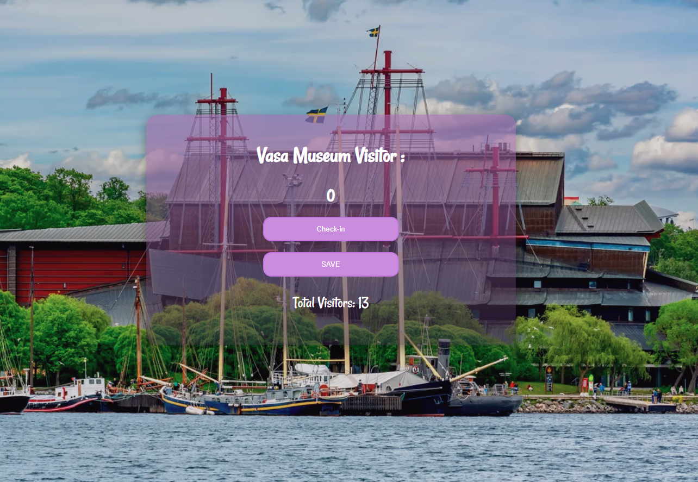

# Vasa Museum Visitor Counter 

##  Live Demo
https://hayfa327.github.io/Vasa-Museum-Visitor-Counter/

A simple interactive visitor counter inspired by the Vasa Museum in Stockholm.  
This project was built to practice JavaScript DOM manipulation and event handling through a real-world themed example.

---

##  Preview



---

##  Features

- Increase visitor count
- Decrease visitor count
- Instant visual feedback
- Built with HTML, CSS, and JavaScript

---

##  Project Structure
### Vasa-Museum-Visitor
* index.html
* style.css
* profil.png
* README.md


## Purpose of the Project

This project is a beginner-friendly exercise to understand:

* DOM manipulation

* Event listeners

* Updating UI dynamically with JavaScript


##  How to Run Locally

```bash
git clone  https://github.com/hayfa327/Vasa-Museum-Visitor-Counter.git